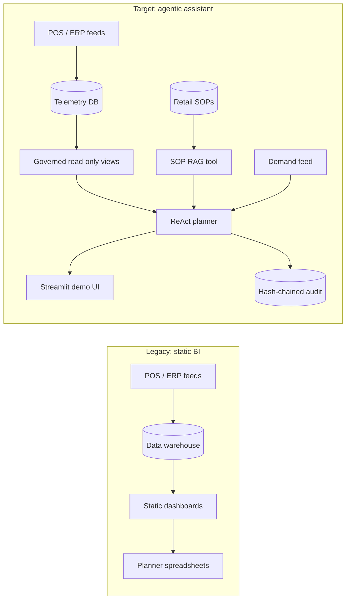
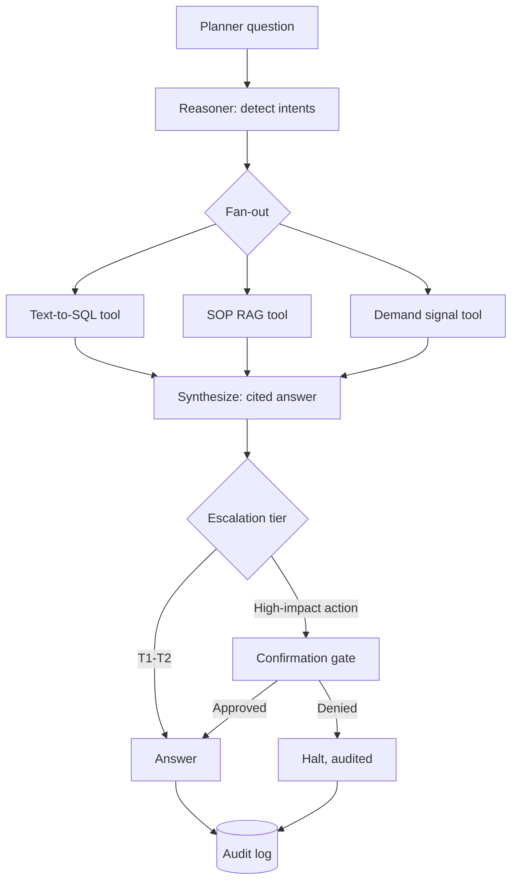
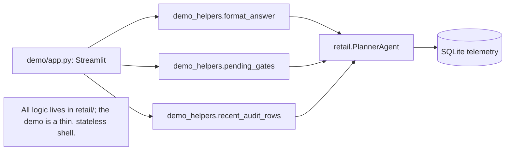
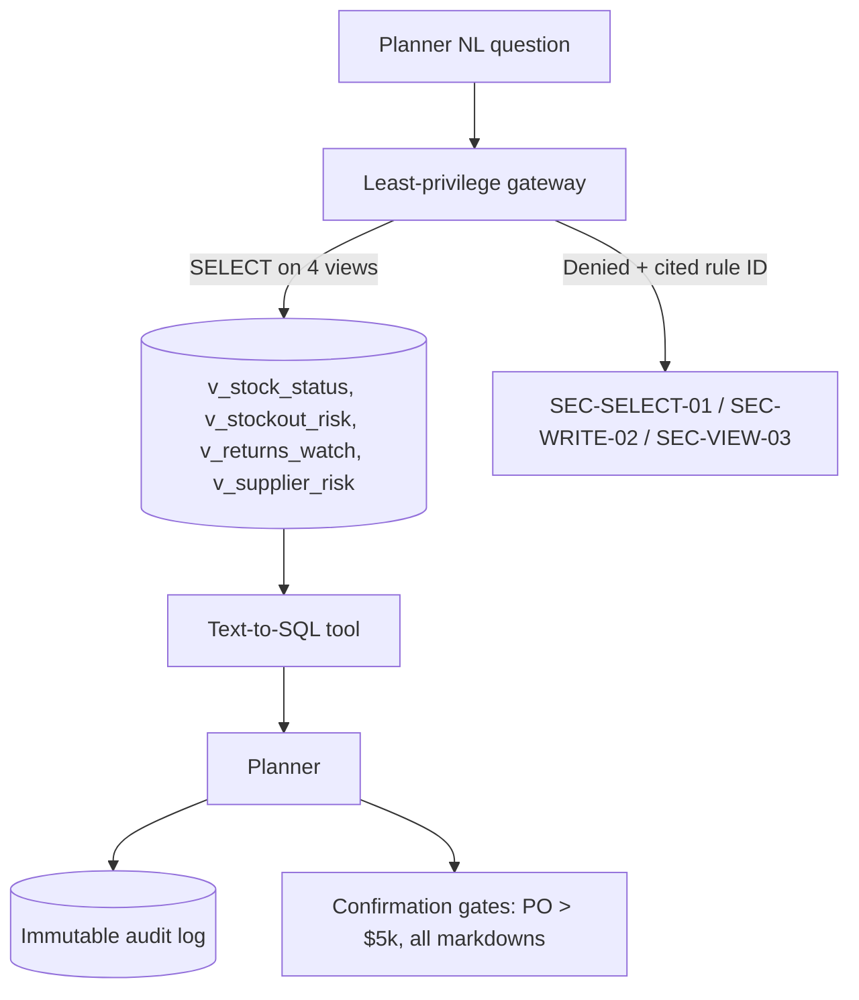

# Architecture

## Legacy vs target

```mermaid
flowchart LR
    subgraph Legacy["Legacy: static BI"]
        POS[POS / ERP feeds] --> DW[(Data warehouse)]
        DW --> BI[Static dashboards]
        BI --> P[Planner spreadsheets]
    end
    subgraph Target["Target: agentic assistant"]
        POS2[POS / ERP feeds] --> DB[(Telemetry DB)]
        DB --> VIEWS[Governed read-only views]
        VIEWS --> AGENT[ReAct planner]
        SOPS[(Retail SOPs)] --> RAG[SOP RAG tool]
        RAG --> AGENT
        FEED[Demand feed] --> AGENT
        AGENT --> UI[Streamlit demo UI]
        AGENT --> AUDIT[(Hash-chained audit)]
    end
```

## ReAct loop

```mermaid
flowchart TD
    Q[Planner question] --> R[Reasoner: detect intents]
    R --> F{Fan-out}
    F --> T1[Text-to-SQL tool]
    F --> T2[SOP RAG tool]
    F --> T3[Demand signal tool]
    T1 --> S[Synthesize: cited answer]
    T2 --> S
    T3 --> S
    S --> E{Escalation tier}
    E -->|T1-T2| A[Answer]
    E -->|High-impact action| G[Confirmation gate]
    G -->|Approved| A
    G -->|Denied| H[Halt, audited]
    A --> AU[(Audit log)]
    H --> AU
```

## Demo UI layer

```mermaid
flowchart LR
    UI[demo/app.py: Streamlit] --> H1[demo_helpers.format_answer]
    UI --> H2[demo_helpers.pending_gates]
    UI --> H3[demo_helpers.recent_audit_rows]
    H1 --> P[retail.PlannerAgent]
    H2 --> P
    H3 --> P
    P --> T[(SQLite telemetry)]
    note["All logic lives in retail/; the demo is a thin, stateless shell."]
```

## Security model

```mermaid
flowchart TD
    Q[Planner NL question] --> GW[Least-privilege gateway]
    GW -->|SELECT on 4 views| VIEWS[(v_stock_status, v_stockout_risk, v_returns_watch, v_supplier_risk)]
    GW -->|Denied + cited rule ID| DENY[SEC-SELECT-01 / SEC-WRITE-02 / SEC-VIEW-03]
    VIEWS --> SQLT[Text-to-SQL tool]
    SQLT --> AGENT[Planner]
    AGENT --> AUDIT[(Immutable audit log)]
    AGENT --> GATE[Confirmation gates: PO > $5k, all markdowns]
```
